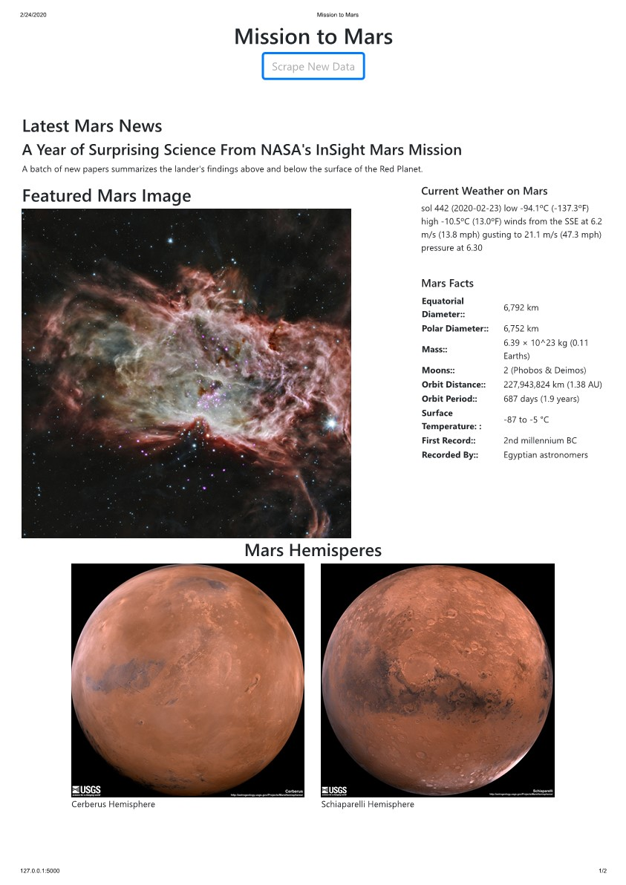

# **Mission to Mars**
This program scrapes mars data from the following websites in order to create a fact sheet with Mars images as a local web page.
- Nasa mars news
- Jet Propulsion Labs
- Twitter account with Mars weather
- Mars Facts
- USGS Astrogeology site for images of Mars' Hemispheres

# ***Files:***
(Written in python)
- app.py is the flask application server
- scrape_mars.py is the file converted from the jupyter notebook to scrape the data
- mission_to_mars.ipynb is the jupyter notebook
- template\index.html is the home page for the server
- chromedrive.exe -- essential for scraping the data 

# ***Database:***
- MongoDB - Database is called mission_to_mars, Collection is called mars_info

# ***Final Result:***

